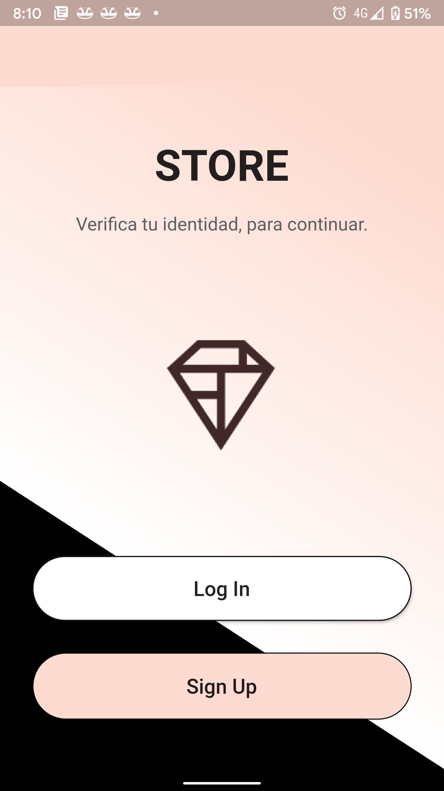
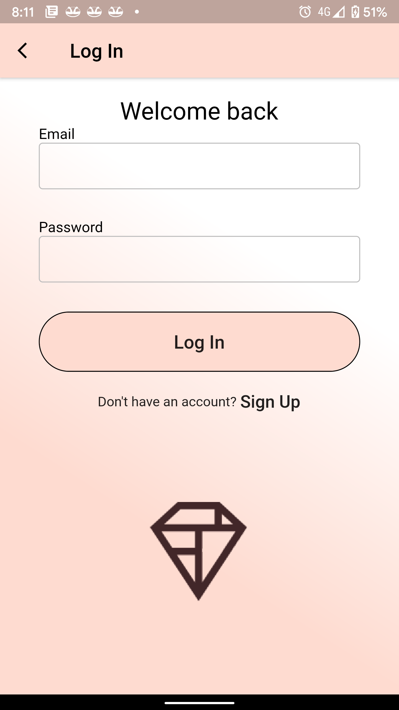
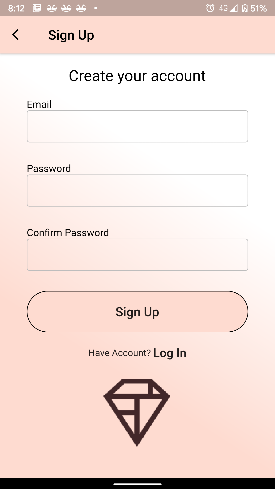
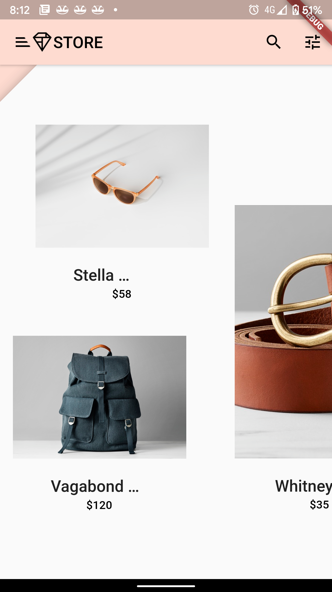
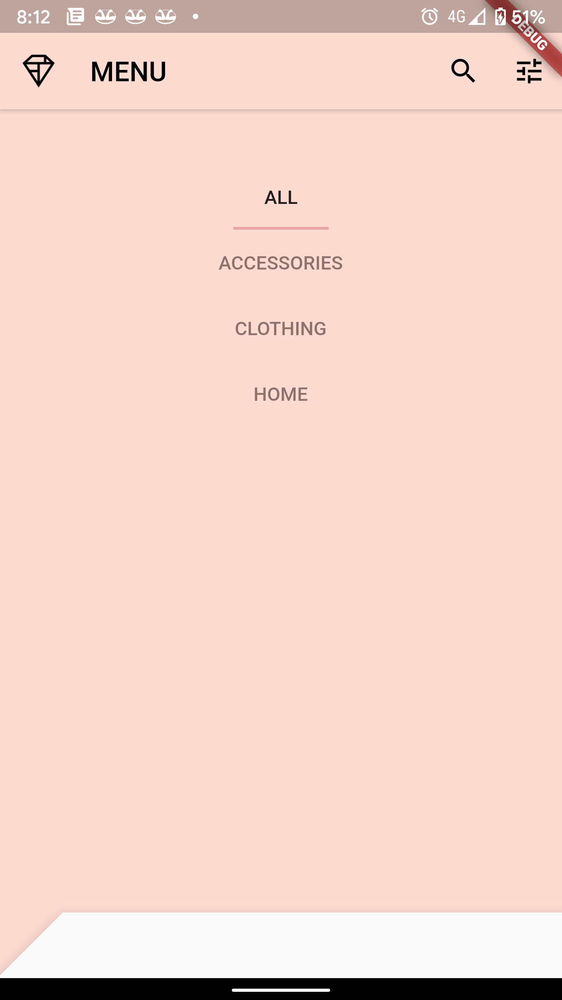
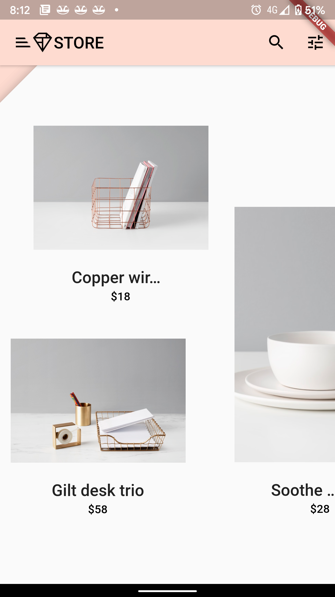
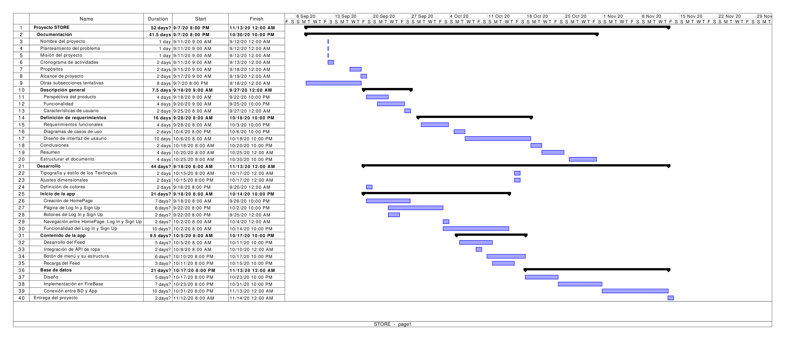

<!-- # coivd_app2

que pedo?
necesitamos definir el nombre de nuestro proyecto

hay que ponerle "STORE" me encanto
Oh okok, va xD, si está chido
mira vamos al titulo
A new Flutter project.

## Getting Started

This project is a starting point for a Flutter application.

A few resources to get you started if this is your first Flutter project:

- [Lab: Write your first Flutter app](https://flutter.dev/docs/get-started/codelab)
- [Cookbook: Useful Flutter samples](https://flutter.dev/docs/cookbook)

For help getting started with Flutter, view our
[online documentation](https://flutter.dev/docs), which offers tutorials,
samples, guidance on mobile development, and a full API reference. -->

<!-- http://www.cse.chalmers.se/~feldt/courses/reqeng/examples/srs_example_2010_group2.pdf (SRS Example) -->

<h1>STORE</h1>

 

 

HECTOR HUGO VIDAÑA ARRIETA - 159957

 

DAISY RAMIREZ SANTILLAN - 169822

 

<!-- que somos? no pues somo una empresa que vende ropa e hicimos la app entonces

okok, deja planteo unas cosillas
1.- Qué clase de ropa vendemos? De todo? 

2.- Hacemos ventas a que nivel?, mundial?, o aqui en México? yep entonces aqui en mex

3.- Hay que pensar en una problematica a resolver, que te parece que nuestra app sea un portal para muchos negocios pequeños de ropa, y mediante nuestra app sea como se den a conocer? 

suponiendo que somos una tienda como h&m la conoces? pues ya sabran que hay una app para comprar en linea
o no se que tengas e mente -->

<!-- ## Resumen -->

<!-- STORE una app para vender algunos productos de la vida cotidiana, con un sencillo uso intuitivo
encontrara todas las cosas que necesita en la palma de su mano  -->
## 1. Introducción

En este documento se encontrará información referenciada a la aplicacion, el planteamiento del porqué la realización del proyecto, las misiones y objetivos del mismo, con la finalidad de dar mejor entendimiento a nuestro enfoque en el proyecto se encontrarán, los requerimientos necesarios para la realización de este proyecto algunas restricciones y algunas muestras de interfaz de diseño aplicado en la aplicación, al leer el documento se le facilitará el entendimiendo y el porqué de nuestro proyecto.

### 1.1 Planteamiento del problema
__¿Por qué una aplicación para vender productos?__ 

La nueva normalidad con la llegada de la pandemia mundial ha impactado fuertemente en los negocios comerciales, el contacto entre las parsonas se ha reducido lo mas posible para evitar la propagación de los contagios. A raíz de esto muchas personas se vieron en grandes dificultades para salir de sus hogares sin arriesgarse.

La demanda en el uso de las redes y las compras en línea incrementó significativamente, es eficiente y entraría muy bien al mercado las aplicaciones de ventas, teniendo impacto entre jóvenes y adultos que buscan las cosas con facilidad y sin problemas a través del internet, la importancia es que nuestros clientes en esta pandemia no se vean tan necesitados en salir y puedan mantenerse en sus hogares y cuidar de sus seres queridos. 

<!-- La nueva normalidad con la llegada de la pandemia mundial ha impactado fuertemente en los negocios comerciales, el contacto entre las parsonas se ha reducido lo mas posible para evitar la propagación de los contagios. A raíz de esto muchas personas se vieron en grandes dificultades para salir a las tiendas -->

### 1.2 Misión
Nuestra misión es hacer que nuestros clientes encuentren todo lo necesario para sus hogares y todo desde la comodidad de su casa, con la seguridad y rapidez de que sus productos lleguen hasta sus puertas con entregas a nivel nacional, esto con el fin de que nuestros usuarios se resguarden en tiempos de pandemia, fue una observación muy clave al momento de crear nuestra aplicación.

### 1.1 Propósito
El proposito de nuestro proyecto era impulsar las compras en lineas y darnos a conocer como una empresa nueva e independiente que vende articulos para usos del hogar y personal, tambien para impulsar trabajos independientes y generar empleo para desarrolladores jovenes que buscan crecer en este ambito de la programacion. 

### 1.2 Alcance
El proyecto no incluye la seleccion de paqueteria con el que se desea entregar el producto, solo se entregara por predeterminado segun sea el pais en el que se vaya a entregar en cuestion, en caso de que se quiera entregar el producto por un sistema de logistica diferente habra que pagar una cantidad extra que se vera reflejado a la hora de terminar la compra de sus productos, tambien la empresa se hara cargo de la devolucion de producto defectuoso o problemas con la aplicacion si el producnto no llegua o haya llegado en mal estado.

### 1.3 Definiciones y acrónimos

### 1.4 Referencias

## 2. Descripción general

En Store encontraras productos para dama y caballero como articulos para el hogar y todo a la palma de tu mando, encuentra todo lo que te guste y comparlo en linea, lo recibiras desde la comodidad de tu hogar sin tener que salir de el, protegemos a los nuestros.

### 2.1 Perspectiva del producto

La plataforma STORE permitirá dar el sustento total de una aplicación de comercio electrónico enfocado para proveer un portal entre consumidores a nivel nacional y los productos de nuestra tienda departamental, proporcionando el catalogo de venta, un carrito de compras eletrónico, formas de pago en línea.

### 2.2 Funcionalidad del producto

La versión 1.0.0 de la aplicación contará con las siguientes funcionalidades:

* __Registro__: Esta función permite a al usuario dar de alta una cuenta para tener un acceso propio a aplicación. El registro puede ser mediante correo electrónico o vinculando una cuenta de google.
* __Inicio de sesión__: Acceso a la aplicación con el prerequisito de un registro previo. El inicio puede ser mediante correo electrónico o vinculando una cuenta de google.
* __Busqueda__: Función de filtrado específica para localizar productos mediante el nombre.
* __Catalogo__: Tarjetas individuales de cada producto disponible en la tienda, incluye nombre, descripción, precio y boton de carrito.
* __Carrito de compra__: Cesta de artículos que el cliente genera en base a los productos que quiere comprar en el momento, con el fin de hacer un solo pago individual al final del proceso.

### 2.3 Características de usuario

| Actores | Descripcion |
|-|-|
|Clientes casuales| Crean cuenta de usuario, revisan el contenido si es de su agrado. |
|Cliente VIP|Usuario que decida pagar para agilizar la llegada de su producto.|
|Trabajadores de la empresa|Obtendran descuento al comprar productos de la aplicacion.|
|Clientes con tickets de promocion|Se le aplicara la promocion al termino de la compra siempre y cuando esta promocion no haya vencido.|
|Clientes por mayores| Al comprar mas de cierto presupuesto su envio sera gratuito.|

### 2.4 Restricciones

|Restricciones|Descripcion|
|-|-|
|Coste|La aplicacion propone que al principio de año tenga una ganancia de 60,000 de esta manera se recuperaria lo invertido y podriamos seguir apostando por el proyecto.|
|Tiempo| La aplicacion fue creada en 42 dias habiles segun el formato a seguir de la planeacion del proyecto.|
|Alcance|La aplicacion finalmente sera lanzada para Android e IOS en sus respectivas tiendas podran bajar y hacer uso de la aplicacion version 1.0.0.|

## 3. Requerimientos

### 3.1 Requerimientos funcionales

| ID | Nombre | Prioridad | Descripción | Dependencias |
| - | - | - | - | - |
| RF01 | Registro de usuario | Alta | Registrar un nuevo usuario en la base de datos de la aplicación, requiere ingresar correo y contraseña | Acceso a internet |
| RF02 | Inicio de sesión de usuario | Alta | Usuarios ya existentes podrán acceder a la aplicación, requiere ingresar correo y contraseña | Registro de usuario |
| RF03 | Busqueda de artículos | Media | Reaizar búsquedas solo por nombre de producto | Inicio de sesión de usuario |
| RF04 | Filtro de precio | Baja | Filtrar productos por rango de precios | Inicio de sesió den usuario |
| RF05 | Visualizar productos por catálogo | Media | Proporcionar distintos catálogos de productos en base a una etiqueta, categoría o todos en general | Inicio de sesión de usuario |
| RF06 | Visualizar productos individualmente | Media | Seleccionar productos para ver más información | Inicio de sesión de usuario, Visualizar productos por catálogo |
| RF07 | Agregar productos al carrito | Media | Guardar productos al gusto del usuario, para posteriormente comprarlos o solo guardarlos | Inicio de sesión de usuario, Visualizar productos individualmente |

### 3.2 Requerimientos específicos

| ID | Requisito | patrón arquitectonico |
| - | - | - |
| RNF01 |Autenticacion | Arquitectura orientada a servicios |
| RNF02 |Autorización | Arquitectura orientada a servicios |
| RNF03 |Asignacion de funcionalidades | MVC |
| RNF04 |Operaciones CRUD | Capas, MVC |
| RNF05 | Envios y recepcion de datos |Arquitectura de datos |
| RNF06 | Envio y recepciond e datos deacuerdo a un modelo definido | Arquitectura orientada a servicios |
| RNF07 | Interconexion entre componentes - servicios|Arquitectura orientada a servicios |
| RNF08 | Abstraccion de diseño de sistemas de datos relacionales | Capas |

### 3.3 Diseño

#### 3.3.1 Interfaz de usuario

 

__Interfaz inicial__

Al abrir la aplicación en su primer uso el usuario se encontrará con la pantalla de presentación e acceso. Aquí se presenta dos opciones, que el usuario ingrese a la aplicación con una cuenta existente o darse de alta como un usuario nuevo.

 

__Iniciar sesión__

Si el usuario ya se había registrado con anterioridad típicamente accederá a la pantalla de Log In para introducir su correo eletrónico y su contraseña, una vez hecho esto solo tiene que presionar el botón __Log In__, esto dará acceso al contenido de la aplicación.

 

__Registro__

Para usuarios nuevos es necesario dar de alta su correo eletrónico y contraseña para registrarlo en la base de datos del sistema, seguidamente solo tiene que presionar el botón de __Sign In__, en caso de no introducir la contraseña exactamente igual en los dos campos se reiniciará esta pantalla, y si fue correcto se redireccionará a la pantalla de Log In para ingresar.

 

__Catálogo inicial__

Una vez identificado el usuario se redireccionará a catálogo principal donde se le mostrará productos de variedad. En esta interfaz el usuario puede visualizar de manera rápida los productos con su nombre y y precio, adicionalmente siempre tendrá acceso a realizar busquedas por nombre, aplicar filtros simples de precio y un botón de menú.

 

__Menú__

El usuario podrá navegar entre productos de un tipo de clasificación, actualmente sólo se cuenta con tres categorías, al seleccionar una de ellas será redireccionado a catálogos de ese tipo.

 

__Catálogos específicos__

Estos catálogos muestran productos bajo una clasificación o etiqueta, esta interfaz es resultado de los catálogos seleccionados del menú y, resultados de busquedas y filtros.

## Anexo A: Planificación inicial del proyecto 

